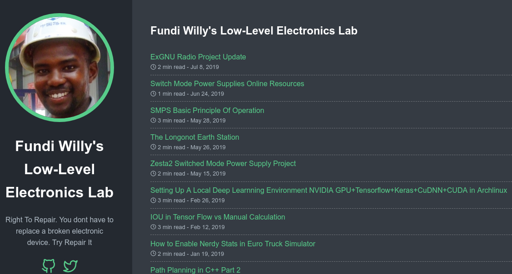

# [wilfred.githuka.com](https://wilfred.githuka.com)
> My technical blog where I write about electronic projects am working on.

[![NPM Version][npm-image]][npm-url]
[![Build Status][travis-image]][travis-url]
[![Downloads Stats][npm-downloads]][npm-url]

This blog/website is devoted to low level, backward-compatible electronic projects which would really be considered obsolete in todays digital
world. I care about such knowledge because its the building blocks of most of what we use today. I will do my best to ensure the information
that I publish is correct and also credit the source of information.

## Installation

Because this is a minimal static website powered by Go, you can have a copy of the entire content.

Just do a simple git clone and you are done.

I have moved the blog to a new git repo. So some posts images are still not available, but I will soon add them.

Trying to keep the blog's size to below 15MB incl of images. [minimalism]

## Release/Update History

* 0.1.3
    * PRODUCTION: Sent To Server LIVE
    * SMALL UPDATE: Header Image for README.md file is set.
    * WEBSITE_SIZE: 4.9MB
    * README.md Title header linked to live site    
* 0.1.2
    * UPDATE TESTING: Updated 3 New Posts. 
    * However old posts still have no images.
    * No main header image set.
* 0.0.1
    * Work in progress

## Meta

Your Name – [@wilfredgithuka](https://twitter.com/wilfredgithuka) – wilfred.gachugi[-at-]gmail.com

Distributed under the XYZ license. See ``LICENSE`` for more information.

[https://github.com/wilfredgithuka/wilfred.githuka.com](https://github.com/wilfredgithuka/)

## Contributing

1. Fork it (<https://github.com/wilfredgithuka/wilfred.githuka.com/fork>)
2. Create your feature branch (`git checkout -b feature/fooBar`)
3. Commit your changes (`git commit -am 'Add some fooBar'`)
4. Push to the branch (`git push origin feature/fooBar`)
5. Create a new Pull Request

<!-- Markdown link & img dfn's -->
[npm-image]: https://img.shields.io/npm/v/datadog-metrics.svg?style=flat-square
[npm-url]: https://npmjs.org/package/datadog-metrics
[npm-downloads]: https://img.shields.io/npm/dm/datadog-metrics.svg?style=flat-square
[travis-image]: https://img.shields.io/travis/dbader/node-datadog-metrics/master.svg?style=flat-square
[travis-url]: https://travis-ci.org/dbader/node-datadog-metrics
[wiki]: https://github.com/wifredgithuka/wilfred.githuka.com/wiki
